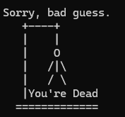
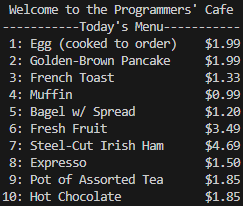
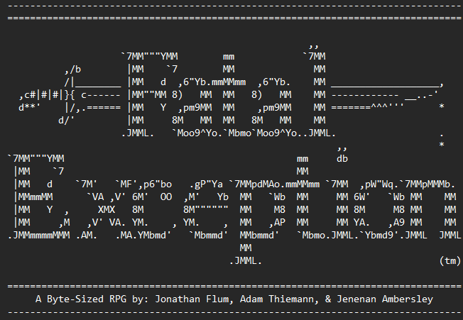
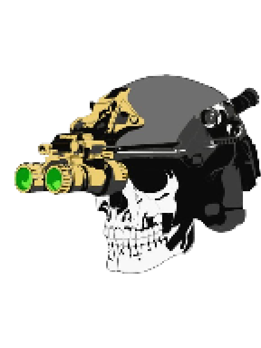

Portfolio
=========

Programming Projects
--------------------

*For access to my private project repositories, please **[email me](https://mail.google.com/mail/?view=cm&source=mailto&to=thiemann.adam@gmail.com&su=Github_Access)**.

---
### [Hangman | CSCI 235](project1.md)

---
### [Restaurant Menu | CSCI 235](project2.md)

---
### [Fatal Exception | CSCI 325](project3.md)

---
### [A Solemn Evolution | CSCI 498](project4.md)

---

Ethics Papers
-------------

### [Edward Snowden Wiki Leaks Scandal](https://1drv.ms/b/s!Aofa4H6h1GyzgY4sqRGIHozFOfjy4A?e=7N53Ng)

-   **Class:**  CSCI 405 Principles of Cybersecurity
-   **Grade:** A+

### [Technology Rolls Along](https://1drv.ms/b/s!Aofa4H6h1GyzgY4m2C_Rp8a8cbMT_A?e=hNcyRD)

-   **Class:** CSCI 315 Data Structures
-   **Grade:** A+

### [Placing Ethical Codes into Faith](./pdf/Ethics_v4.pdf)

-   **Class:** CSCI 235 Procedural Programming 
-   **Grade:** A+

---

Presentations
-------------

### [Hybrid Warfare](https://1drv.ms/p/s!Aofa4H6h1GyzgY4pWT64OkoOW6_r1g?e=kr7G1I)

- **Class:** CSCI 405 Principles of Cyber Security
- **Grade:** A+

### [Stuxnet: The Dawn of Cyber Warfare](https://1drv.ms/p/s!Aofa4H6h1GyzgY4qXPuC5JNuiaE2ZQ?e=fAwvby)

- **Class:** CSCI 405 Principles of Cyber Security
- **Grade:** A+

---

Page template forked from <a href="https://github.com/csu-cs/csci-portfolio">CSU-CS</a>

<!-- Remove above link if you don't want to attributive -->
